# 📱 Your App Name

  
   
  
<em>Your all-in-one study companion—Notes,Question Papers,Video lectures,attendance,Time table,Year plan,coding and more!</em>

## 📱 Screens🔥
📱 Main App Screens

  <table>
    <tr>
      <td>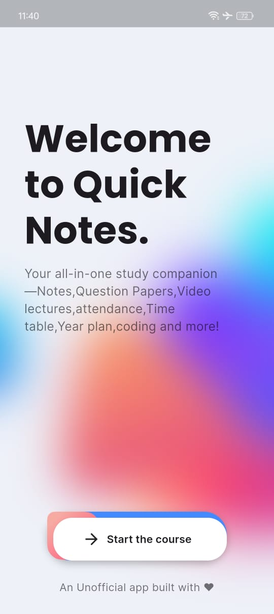</td>
      <td></td>
      <td>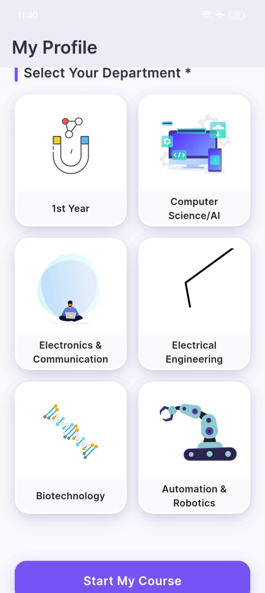</td>
    </tr>
    <tr>
      <td align="center">Home</td>
      <td align="center">Profile</td>
      <td align="center">Profile Extended</td>
    </tr>
  </table>
  <table>
    <tr>
      <td>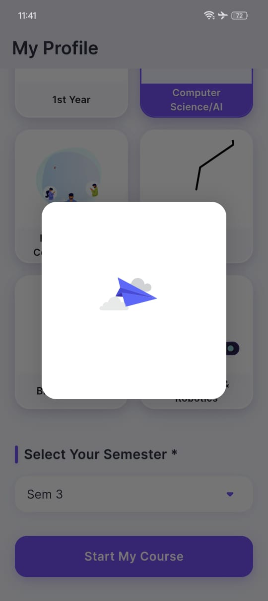</td>
      <td>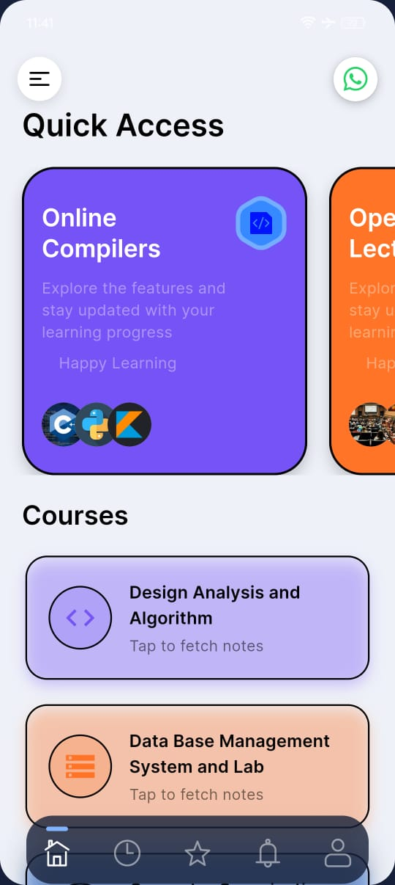</td>
      <td>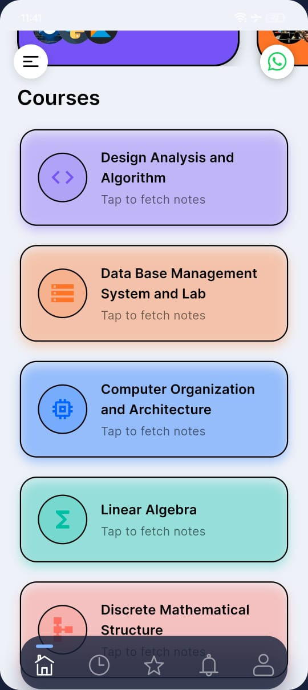</td>
    </tr>
    <tr>
      <td align="center">Profile Details</td>
      <td align="center">Main Dashboard</td>
      <td align="center">Features Dashboard</td>
    </tr>
  </table>
  <table>
    <tr>
      <td>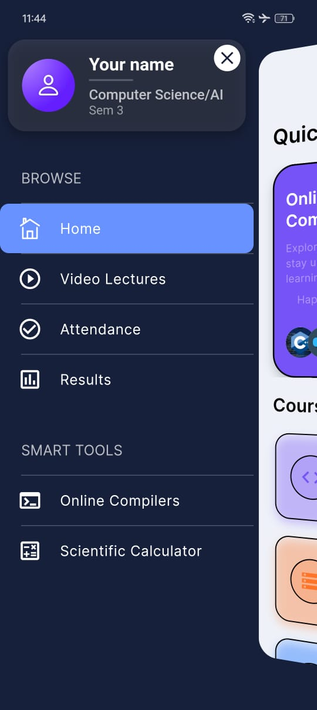</td>
      <td>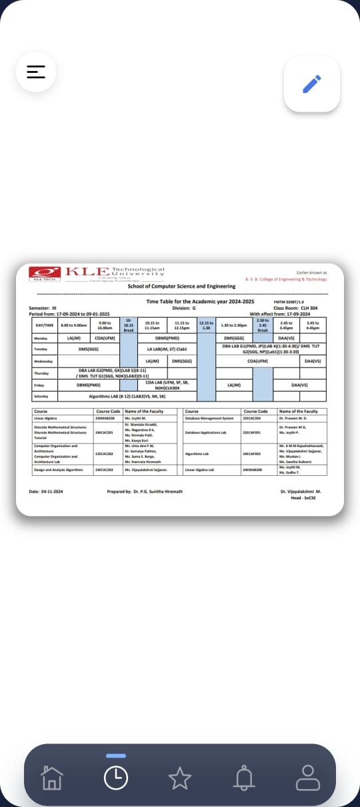</td>
      <td>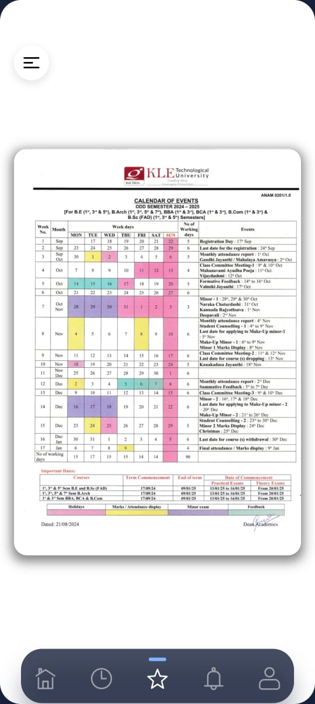</td>
    </tr>
    <tr>
      <td align="center">Quick Navigation</td>
      <td align="center">Time Table</td>
      <td align="center">COE Portal</td>
    </tr>
  </table>
  <table>
    <tr>
      <td>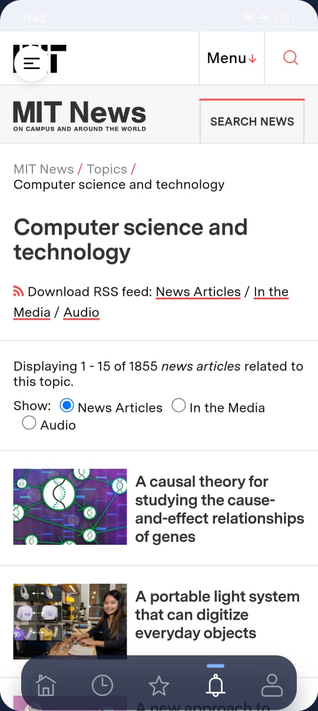</td>
      <td>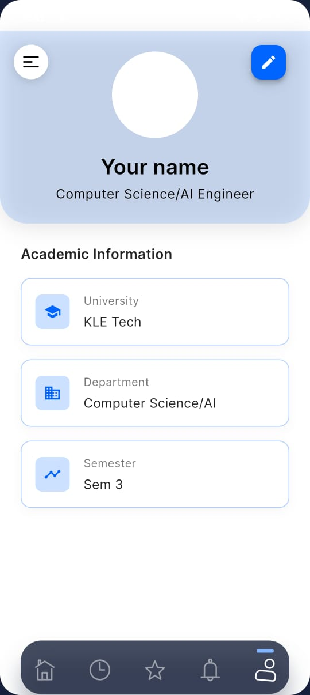</td>
    </tr>
    <tr>
      <td align="center">Latest News</td>
      <td align="center">Edit Profile</td>
    </tr>
  </table>

📚 Academic Helper

  <table>
    <tr>
      <td>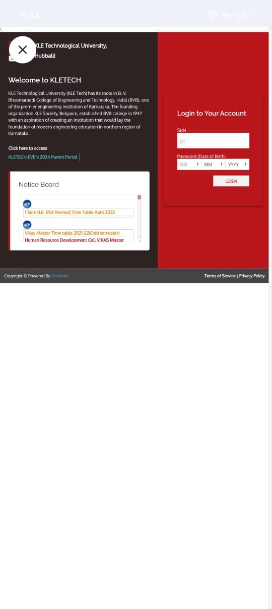</td>
      <td>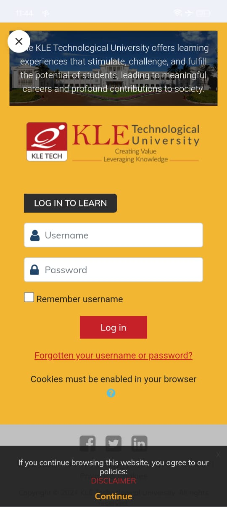</td>
    </tr>
    <tr>
      <td align="center"><b>Attendance Tracker</b></td>
      <td align="center"><b>Learning Management</b></td>
    </tr>
  </table>

🛠️ Smart Tools

  <table>
    <tr>
      <td>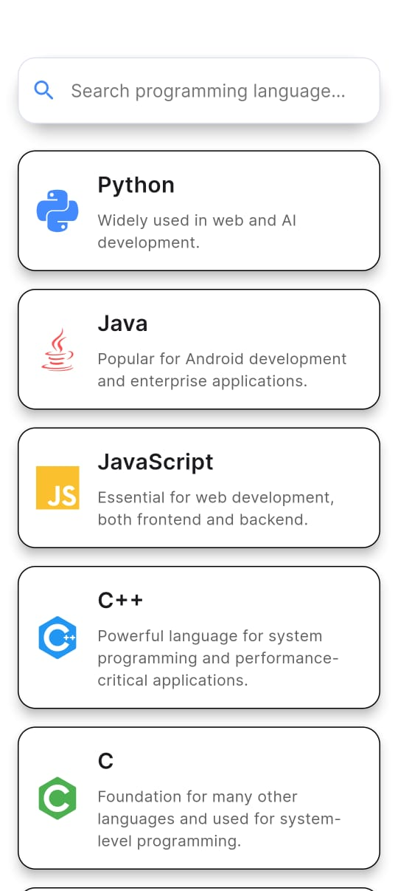</td>
      <td>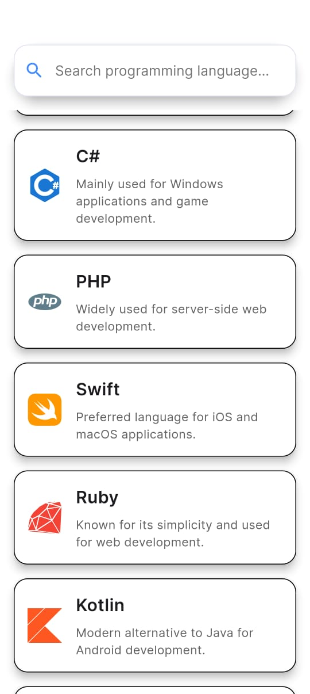</td>
      <td>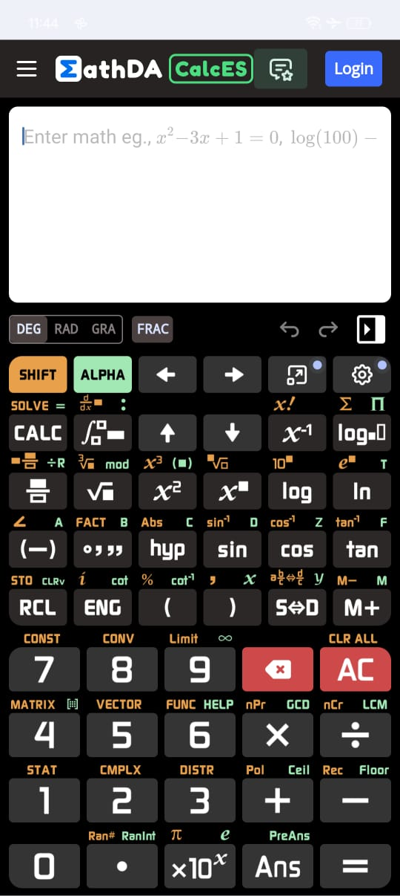</td>
    </tr>
    <tr>
      <td align="center"><b>Smart Compiler</b></td>
      <td align="center"><b>Compiler Options</b></td>
      <td align="center"><b>Smart Calculator</b></td>
    </tr>
  </table>

## ✨ Key Features

- 🏠 Intuitive home dashboard with quick access to all features
- 📊 Real-time attendance tracking and monitoring
- 📝 Built-in grade calculator for academic performance
- 📅 Dynamic timetable management
- 💻 Integrated Learning Management System
- 🖥️ Online code compilation and execution
- 👤 Comprehensive profile management
- 📰 Latest campus news and updates
- 📋 Examination portal access
- 🔄 Regular feature updates and improvements

## 🔧 Technical Requirements

- Android 6.0 or higher
- Minimum 2GB RAM
- Internet connection required
- Storage: 50MB free space

## 📥 Installation

1. Download the latest APK from [Releases](link-to-releases)
2. Enable installation from unknown sources
3. Install and enjoy!

## 🤝 Support

For any queries or support:
- 📧 Email: support@yourdomain.com
- 💬 In-app support available
- 📱 Contact: +XX XXXXX XXXXX

---

  Made with ❤️ for Students

